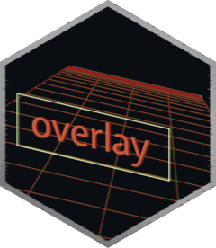

<!-- README.md is generated from README.Rmd. Please edit that file. -->

# overlay 

overlay renders ggplot2 and gt objects as images, optionally wraps them
in a dark HUD-style panel, applies perspective warp distortions, and
composites them over a background image — producing a heads-up display
effect.


## Installation

Install overlay from GitHub with remotes (or pak)

``` r
# install.packages("remotes)
remotes::install_github("luisdva/overlay")
```

## Overview

The package has five functions that can be used individually or chained
together:

| Function          | What it does                                        |
|-------------------|-----------------------------------------------------|
| `render_hud()`    | Rasterizes a ggplot2 or gt object to a magick image |
| `hud_panel()`     | Adds a frame around the rasterized image            |
| `warp_hud()`      | Applies a 4-corner perspective distortion           |
| `composite_hud()` | Composites the overlay onto a background image      |
| `hud_overlay()`   | Convenience wrapper for the full pipeline           |

## Quick start

``` r
library(ggplot2)
library(overlay)

p <- ggplot(mtcars, aes(wt, mpg)) + geom_point()

p |>
  hud_overlay(
    background = "photo.jpg",
    placement  = "bottom-right",
    size       = "medium",
    panel      = TRUE,
    tilt       = "left",
    opacity    = 0.9
  )
```

## Usage

### `hud_overlay()`

`hud_overlay()` wraps all the relevant functions (render → panel → warp
→ composite) in a single call. The overlay is the first argument so
ggplot2 and gt objects can be piped directly into it.

``` r
hud_overlay(
  overlay,           # ggplot2 or gt object
  background,        # path, URL, or magick-image
  placement = NULL,  # "left", "right", "centre", "top", "bottom", "top-left", …
  x = NULL,          # pixel offset (overrides placement)
  y = NULL,
  margin = 40L,      # edge gap when using placement
  size = NULL,       # "small", "medium", "large", "xl", "xxl"
  width = 400,       # explicit pixel dimensions (override size)
  height = 300,
  bg = "transparent",# background color for the rendered overlay
  res = 150,         # DPI resolution for rendering
  panel = FALSE,     # TRUE, FALSE, or named list forwarded to hud_panel()
  tilt = NULL,       # "none", "left", "right", "top", "bottom"
  corners = NULL,    # named list of c(dx, dy) offsets: tl / tr / bl / br
  keep_size = TRUE,  # crop/pad warped result back to original size
  opacity = 0.85,
  supersample = 2L,  # anti-aliasing factor; increase for steep warps
  operator = "over"  # ImageMagick compositing operator
)
```

`tilt` is a convenience preset. For full control, supply `corners`
directly — each entry is a `c(dx, dy)` pixel offset from that corner’s
natural position:

``` r
# Lean the panel to the left
p |>
  hud_overlay(
    background = "photo.jpg",
    corners = list(tl = c(-110, 0), bl = c(-110, 0))
  )
```

### Step-by-step pipeline

Each function can also be called individually, which is useful when you
want fine-grained control over an intermediate step:

``` r
library(ggplot2)
library(overlay)

p <- ggplot(mtcars, aes(hp, mpg)) + geom_point()

# 1. Rasterise
img <- render_hud(p, width = 500, height = 320, res = 150)

# 2. Add a dark panel with a neon border
img <- hud_panel(
  img,
  padding       = 20,
  panel_color   = "#111111CC",
  border_color  = "#39FF1488",
  border_width  = 2
)

# 3. Warp
img <- warp_hud(
  img,
  corners = list(tl = c(-90, 0), bl = c(-90, 0))
)

# 4. Composite
out <- composite_hud(
  background = "photo.jpg",
  overlay    = img,
  x = 60, y = 80,
  opacity    = 0.9
)

magick::image_browse(out)
```

### Saving the result

`hud_overlay()` and `composite_hud()` return a `magick-image` object:

``` r
magick::image_write(out, "result.png")
```

## Dependencies

- [magick](https://docs.ropensci.org/magick/) — image processing
  (requires ImageMagick to be installed on your system)
- [ragg](https://ragg.r-lib.org/) — high-quality graphics rendering
- [ggplot2](https://ggplot2.tidyverse.org/) *(suggested)* — for ggplot
  objects
- [gt](https://gt.rstudio.com/) *(suggested)* — for table objects

## License

MIT
