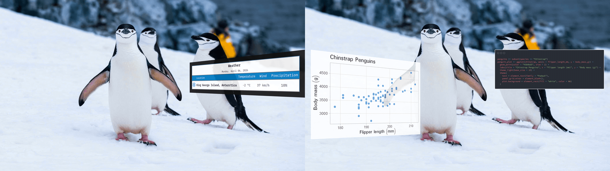

# overlay

overlay renders ggplot2 or gt objects as well as code snippets into
magick image objects, optionally adds a heads-up display (HUD) panel
border, applies perspective warps, and composites the result over a
background image with optional transparency.

This could be done quite easily in PowerPoint or other graphic design
software, but writing this as a package lets us work with objects in our
R environment programmatically and reproducibly.

> Example outputs. Left: a gt table with an added border; Right: a
> ggplot2 object with perspective tilt and the underlying code as a
> carbon.js image. Photograph by Derek Oyen, Unsplash.



## Installation

Install overlay from GitHub with remotes (or pak)

``` r

# install.packages("remotes")
remotes::install_github("luisdva/overlay")

# Alternatively, with pak
# install.packages("pak")
pak::pak("luisdva/overlay")
```

This package uses magick (ImageMagick). Ensure ImageMagick is installed
on your system (see System requirements below).

## Overview

The package has five functions that can be used individually or chained
together:

| Function | Behavior |
|----|----|
| [`render_hud()`](https://luisdva.github.io/overlay/reference/render_hud.md) | Rasterizes a ggplot2 or gt object to a magick image |
| [`hud_panel()`](https://luisdva.github.io/overlay/reference/hud_panel.md) | Adds a frame around the rasterized image |
| [`warp_hud()`](https://luisdva.github.io/overlay/reference/warp_hud.md) | Applies a four-corner perspective distortion |
| [`composite_hud()`](https://luisdva.github.io/overlay/reference/composite_hud.md) | Composites the overlay onto a background image |
| [`hud_overlay()`](https://luisdva.github.io/overlay/reference/hud_overlay.md) | Convenience wrapper for the full pipeline |

## Quick start

``` r

library(ggplot2)
library(overlay)

p <- ggplot(na.omit(penguins), aes(bill_len, body_mass)) +
  geom_point(alpha = 0.7) +
  theme_minimal()

bg <- system.file("extdata", "penguins.jpg", package = "overlay")

out <- p |>
  hud_overlay(
    background = bg, 
    placement  = "bottom-right",
    size       = "medium",
    panel      = TRUE,
    tilt       = "left",
    opacity    = 0.9
  )

# View or save
# magick::image_browse(out)
```

## Usage

### `hud_overlay()`

[`hud_overlay()`](https://luisdva.github.io/overlay/reference/hud_overlay.md)
wraps all the relevant functions (render, panel, warp, and overlay) in a
single call. The object to overlay is the first argument so the ggplot2
and gt objects can be piped directly into the function.

``` r

hud_overlay(
  overlay,           # ggplot2 or gt object, or carbon image of a code snippet
  background,        # path, URL, or magick-image
  placement = NULL,  # "left", "right", "centre", "top", "bottom", "top-left", …
  x = NULL,          # pixel offset (overrides placement)
  y = NULL,
  margin = 40L,      # edge gap when using placement
  size = NULL,       # "small", "medium", "large", "xl", "xxl"
  width = 400,       # explicit pixel dimensions (overrides size)
  height = 300,
  bg = "transparent",# background color for the rendered overlay
  res = 150,         # DPI resolution for rendering
  panel = FALSE,     # TRUE, FALSE, or named list forwarded to hud_panel()
  tilt = NULL,       # "none", "left", "right", "top", "bottom"
  corners = NULL,    # named list of c(dx, dy) offsets: tl / tr / bl / br
  keep_size = TRUE,  # crop/pad warped result back to original size
  opacity = 0.85,
  supersample = 2L,  # anti-aliasing factor; increase for steep warps in case of visual artifacts
  operator = "over"  # ImageMagick operator for overlays
)
```

Precedence: corners \> tilt; explicit width/height \> size; explicit x/y
\> placement.

`tilt` is a convenience preset. For full control, supply `corners`
directly — each entry is a `c(dx, dy)` pixel offset from that corner’s
natural position:

``` r

# Lean the panel to the left
p |>
  hud_overlay(
    background = system.file("extdata", "penguins.jpg", package = "overlay"),
    corners = list(tl = c(-110, 0), bl = c(-110, 0))
  )
```

### Multiple overlays with pipes

Since
[`hud_overlay()`](https://luisdva.github.io/overlay/reference/hud_overlay.md)
returns a `magick-image` object, we can chain calls to add several
overlays to the same background. Use the base pipe placeholder `_` to
pass the result from one overlay as the background for the next:

``` r

library(ggplot2)
library(overlay)

# Create a plot
penguin_plot <- ggplot(penguins, aes(x = species, fill = species)) +
  geom_bar() +
  theme_minimal() +
  labs(title = "Penguin Species Count")

# Create code image
code <- 'ggplot(penguins, aes(x = species, fill = species)) +
  geom_bar() +
  theme_minimal() +
  labs(title = "Penguin Species Count")'

code_img <- carbon_image(code, lang = "r", theme = "dark")

# Load background
bg <- system.file("extdata", "penguins.jpg", package = "overlay")

# Add multiple overlays using the pipe placeholder
plotandcode <- hud_overlay(
  overlay    = penguin_plot,
  background = bg,
  placement  = "left",
  size       = "xl",
  tilt       = "left",
  opacity    = 0.85
) |> 
  hud_overlay(
    overlay    = code_img,
    background = _,          # Pipe placeholder - uses result from previous step
    placement  = "right",
    size       = "xl",
    tilt       = "none",
    opacity    = 1
  )
```

The `_` placeholder (available in R ≥ 4.2.0) passes the output from the
first
[`hud_overlay()`](https://luisdva.github.io/overlay/reference/hud_overlay.md)
call as the `background` argument to the second call. This lets us build
up complex compositions with multiple plots, tables, and code snippets
on a single background image. Note that the tilt and placement options
for each overlay are independent and not inherited from previous steps.

### Step-by-step pipeline

Each function can also be called individually, which is useful for
debugging or for fine-grained control over an intermediate step:

``` r

library(ggplot2)
library(overlay)

# Create a ggplot2 object
p <- ggplot(mtcars, aes(hp, mpg)) + geom_point()

# Bundled background 
bg <- system.file("extdata", "penguins.jpg", package = "overlay")

# Rasterize
img <- render_hud(p, width = 500, height = 320, res = 150)

# Add a dark panel with a neon border
img <- hud_panel(
  img,
  padding       = 20,
  panel_color   = "#111111CC",
  border_color  = "#39FF1488",
  border_width  = 8
)

# Perspective warp
img <- warp_hud(
  img,
  corners = list(tl = c(-90, 0), bl = c(-90, 0))
)

# Composite
out <- composite_hud(
  background = bg,
  overlay    = img,
  x = 60, y = 80,
  opacity    = 0.9
)

magick::image_browse(out)
```

### Code snippets as images

In addition to ggplot2 plots and gt tables, syntax-highlighted code
snippets can also be added using
[`carbon_image()`](https://luisdva.github.io/overlay/reference/carbon_image.md).
This function uses the community-developed [carbonara
API](https://github.com/petersolopov/carbonara) to generate code images
styled with carbon.js themes. The endpoints may not always be
responsive, but usually work after a few tries in the case of timeout
errors.

``` r

library(overlay)

# Create a code snippet image
plotting_code <- 'library(ggplot2)

ggplot(mtcars, aes(wt, mpg)) +
  geom_point(aes(color = factor(cyl))) +
  theme_minimal() +
  labs(title = "Fuel Efficiency")'

code_img <- carbon_image(plotting_code, lang = "r", theme = "dark")

# Overlay the code on a background
bg <- system.file("extdata", "penguins.jpg", package = "overlay")

out <- bg |>
  hud_overlay(code_img, 
              width = 500, 
              height = 350,
              placement = "center")
```

[`carbon_image()`](https://luisdva.github.io/overlay/reference/carbon_image.md)
supports both dark and light themes and by default is mostly hard-coded,
but the output can be customized with additional parameters:

``` r

# Light theme with custom settings
code_img <- carbon_image(
  plotting_code,
  lang = "r",
  theme = "light",
  fontSize = "16px",
  fontFamily = "Fira Code"
)
```

### Saving the result

[`hud_overlay()`](https://luisdva.github.io/overlay/reference/hud_overlay.md)
and
[`composite_hud()`](https://luisdva.github.io/overlay/reference/composite_hud.md)
return a `magick-image` object, which can be saved with
[`magick::image_write()`](https://docs.ropensci.org/magick/reference/editing.html)

``` r

magick::image_write(out, "result.png")
```

## Depends

- [magick](https://docs.ropensci.org/magick/) for image processing
  (requires ImageMagick to be installed on your system)
- [ragg](https://ragg.r-lib.org/) for crisp high-quality graphics
  rendering
- [ggplot2](https://ggplot2.tidyverse.org/) plots using the grammar of
  graphics
- [gt](https://gt.rstudio.com/) for great-looking tables
- [httr](https://httr.r-lib.org/) (suggested) for carbon code image API
  requests

### System requirements

- ImageMagick (required by magick). Verify with
  [`magick::magick_config()`](https://docs.ropensci.org/magick/reference/config.html)
  in R or `magick --version` in the terminal.
- Fonts: when using custom fonts, make sure they are available.

### LLM disclosure

This package was developed with extensive input from various Large
Language models from multiple providers (Anthropic, Google, OpenAI,
Groq), implemented via autocomplete, through Posit Assistant, Positron
Assistant, the Continue and Roo Code extensions for Positron, ellmer, or
in Terminal User Interfaces like Gemini CLI. This package is not
necessarily ‘vibe-coded’, but includes as much AI-generated code as I
think I’ll ever include in my work. Developing overlay was in part an
experiment in LLM-assisted development, and also a way to get a better
idea of token usage, costs, rate limits, and how the different
implementations compare. I still take full responsibility for this code
and its bugs.

## License

MIT
